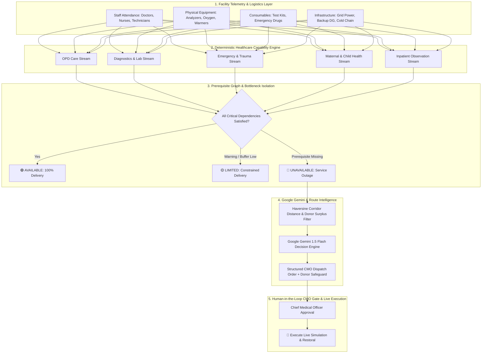

# PHC-Twin 🏥⚡
### AI-Powered Healthcare Capability Intelligence & Decentralized Supply Chain Resilience

[](https://nextjs.org/)
[](https://www.typescriptlang.org/)
[](https://ai.google.dev/)
[](https://leafletjs.com/)
[](https://tailwindcss.com/)
[](https://vercel.com/)

> **"From Resource Availability to Healthcare Capability"**  
> *"Traditional dashboards measure what facilities have. PHC-Twin computes what healthcare they can actually deliver."*

---

## 📑 Table of Contents
- [Executive Summary](#-executive-summary)
- [Hackathon Track & Challenge Alignment](#-hackathon-track--challenge-alignment)
- [The Core Problem: Resource Availability ≠ Healthcare Capability](#-the-core-problem-resource-availability--healthcare-capability)
- [Core Innovation & System Architecture](#-core-innovation--system-architecture)
- [Interactive Geographic Highway & Transit Map](#-interactive-geographic-highway--transit-map)
- [5 Core Clinical Service Streams](#-5-core-clinical-service-streams)
- [Google AI & Gemini 1.5 Flash Integration](#-google-ai--gemini-15-flash-integration)
- [Mathematical & Algorithmic Formulation](#-mathematical--algorithmic-formulation)
- [Step-by-Step Judge & Evaluator Demo Scenario](#-step-by-step-judge--evaluator-demo-scenario)
- [National-Scale Indian Dataset & BRICS Blueprint](#-national-scale-indian-dataset--brics-blueprint)
- [Getting Started Locally](#-getting-started-locally)
- [Deployment Guide](#-deployment-guide)
- [Ethical Safeguards & Human-in-the-Loop](#-ethical-safeguards--human-in-the-loop)

---

## 🌟 Executive Summary

Across the **150,000+ Primary Health Centres (PHCs) and Ayushman Bharat Health & Wellness Centres (AB-HWCs)** in India, public health management systems track **physical inventory** &mdash; counting machines, beds, and drug boxes.

However, a facility with a brand-new hematology analyzer cannot conduct blood tests if the **lab technician is absent**. An emergency room with crash carts cannot treat acute trauma if the **doctor is missing**.

**PHC-Twin** is a decentralized digital twin platform that transforms raw health telemetry into **clinical service capability intelligence**:
1. Evaluates all prerequisite dependencies (Staff, Equipment, Consumables, Infrastructure) deterministically.
2. Identifies Single Points of Failure (SPOFs) before they result in community patient denial.
3. Automatically routes inter-facility resource sharing and rotational staffing over real road networks.
4. Uses **Google Gemini 1.5 Flash** for structured operational decision support with strict **Chief Medical Officer (CMO)** authorization gates.

---

## 🏆 Hackathon Track & Challenge Alignment

- **Competition**: Google Cloud Hackathon — *Build with AI: Code for Communities (Second Edition)*
- **Track**: Smart Health & Supply Chain Resilience
- **Theme**: BRICS Resilience
- **Solution Pillars**:
  - 🔍 **Medicine Stock Visibility & Demand Forecasting**: 7-day proactive stockout horizons with risk scoring.
  - 👥 **Human Dependency Modeling**: Resolves lab technician, nurse, and doctor single-points-of-failure.
  - 🗺️ **Inter-Facility Resource Redistribution**: Highway-aware donor surplus matching and rotational staff dispatch.
  - 🤖 **Google Gemini Decision Intelligence**: Structured administrative order synthesis with donor safety thresholds.
  - 🔒 **BRICS Federated AI Blueprint**: Cross-border intelligence without sharing sensitive sovereign patient records.

---

## 💡 The Core Problem: Resource Availability ≠ Healthcare Capability

| Traditional Hospital Dashboard ❌ | PHC-Twin Healthcare Intelligence Platform ✅ |
| :--- | :--- |
| **Physical Inventory Focus**: *"Facility has 1 hematology analyzer, 12 beds, and power."* | **Clinical Delivery Focus**: *"Can this PHC deliver diagnostic blood tests right now?"* |
| **Ignores Human Single-Points-of-Failure**: Marks lab as 100% available even if technician is on leave. | **Evaluates Dependency Prerequisite Chains**: Flags lab as **0% UNAVAILABLE** when technician is missing. |
| **Siloed Facilities**: When a stockout occurs, the facility simply turns patients away. | **Multi-Facility Corridors**: Automatically identifies nearest donor hub with surplus staff and computes highway transit times. |
| **Static Data Ledgers**: Delayed monthly reporting. | **Live Digital Twin**: Real-time stress testing, 7-day forecasting, and 1-click simulated recovery. |

---

## 🔬 Core Innovation & System Architecture



---

## 🗺️ Interactive Geographic Highway & Transit Map

PHC-Twin features an **interactive, tile-based geographic map** powered by **Leaflet** and **OpenStreetMap**:

- **Real Highway Corridors**: Renders **NH-30 (Sitapur–Lucknow Expressway)**, **SH-26 (Sitapur–Shivapur Link)**, and **MDR-44 (North Kheri District Road)**.
- **Dynamic Color Pins & Pulsing Radar**:
  - 🔴 **Red Pin**: Critical Service Outage (e.g., PHC Rampur missing lab technician).
  - 🟡 **Yellow Pin**: Limited Buffer / Supply Alert (e.g., PHC Lakshmipur 4-day runway).
  - 🟢 **Green Pin**: Fully Capable facility.
  - 🔵 **Blue Pin**: Regional Donor Hub with verified surplus staff (e.g., Sitapur Urban CHC with 3 technicians).
- **Live Transit Dispatch Corridor**: Simulating an outage draws the animated **NH-30 redeployment route** with estimated transit time (`~18 mins`, `5.2 km`).
- **Road Telemetry Inspector**: Click any highway segment to view classification, surface condition, and transit latency.

---

## 🩺 5 Core Clinical Service Streams

PHC-Twin evaluates healthcare through 5 essential primary care delivery streams:

1. **Basic Outpatient Care (OPD)**: Doctor consultation, triage, routine prescriptions, and basic screening.
2. **Diagnostic & Laboratory Services**: Hematology, rapid diagnostic tests (malaria, dengue, TB), microscopy, and blood glucose testing.
3. **Emergency & Trauma Stabilization**: Acute trauma stabilization, pre-referral shock management, oxygenation, and wound care.
4. **Maternal & Child Health Care**: Antenatal care (ANC), basic delivery support, neonatal warmers, and immunization.
5. **Basic Inpatient & Observation Care**: Short-stay ward admission (24–48 hrs) for acute febrile illness, IV fluid therapy, and postpartum rest.

---

## 🤖 Google AI & Gemini 1.5 Flash Integration

PHC-Twin leverages **Google Gemini 1.5 Flash** (`@google/generative-ai`) to synthesize structured clinical administrative decisions:

```typescript
// Server-Side Route: /api/gemini/analyze
const model = genAI.getGenerativeModel({
  model: 'gemini-1.5-flash',
  generationConfig: { responseMimeType: 'application/json', temperature: 0.2 },
});
```

### Structured Output Schema:
- **`problem`**: Clear clinical capability gap statement.
- **`rootCause`**: Single Point of Failure (SPOF) identification.
- **`recommendation`**: Actionable inter-facility staff dispatch or stock transfer order.
- **`reasoning`**: Operational justification (Resource asymmetry, donor protection, transit latency).
- **`donorSafeguardNote`**: Explicit safety threshold verifying the donor facility will not fall below baseline capacity.
- **`expectedImpact`**: Projected community patient tests and lives protected daily.

*(Offline Resilience: If no `GEMINI_API_KEY` is provided, the platform automatically utilizes its high-fidelity deterministic public health reasoning engine with zero latency).*

---

## 📐 Mathematical & Algorithmic Formulation

### 1. Prerequisite Capability Scoring
For any clinical service $S$ at facility $F$:
$$\text{Score}(S) = \begin{cases} 0 & \text{if any critical dependency } d_{\text{crit}} = 0 \\ \prod_{i} w_i \cdot \min(1, \frac{\text{Resource}_i}{\text{Requirement}_i}) \times 100 & \text{otherwise} \end{cases}$$

### 2. Donor Distance Optimization (Haversine Formula)
$$d = 2R \arcsin \left( \sqrt{\sin^2\left(\frac{\Delta \phi}{2}\right) + \cos(\phi_1)\cos(\phi_2)\sin^2\left(\frac{\Delta \lambda}{2}\right)} \right)$$
Where $R = 6371\text{ km}$, $\phi$ is latitude, and $\lambda$ is longitude.

### 3. Donor Safety Margin Safeguard
A donor candidate $D$ is only eligible for rotational dispatch if:
$$\text{Staff}_{\text{available}}(D) - \text{Staff}_{\text{dispatched}} \ge \text{Staff}_{\text{baseline}}(D)$$

---

## 🧪 Step-by-Step Judge & Evaluator Demo Scenario

Follow this **60-second walkthrough** to evaluate the platform:

1. **Step 1: Explore the Network**  
   Open **[PHC Network](http://localhost:3000/phcs)** &rarr; View the **District Roadmap** on real OpenStreetMap tiles showing Sitapur, UP.
2. **Step 2: Inspect Facility Baseline**  
   Click on **PHC Rampur** &rarr; Notice all 5 services are **🟢 AVAILABLE** (100% coverage).
3. **Step 3: Trigger Live What-If Stress-Test**  
   In the **Live What-If Stress-Test Bar**, click **`Simulate Tech Absence`**.
4. **Step 4: Observe Core Thesis**  
   - Blood analyzers and power remain 100% functional.
   - Diagnostic Service immediately flips to **🔴 UNAVAILABLE (0%)**.
   - Prerequisite graph highlights the missing human dependency.
5. **Step 5: Review AI Intervention & CMO Gate**  
   Scroll down to the **District Decision Intelligence** card &rarr; Notice candidate donor **PHC Sitapur Urban** (5.2 km away on NH-30) selected with donor safety margin verified.
6. **Step 6: Execute Closed-Loop Recovery**  
   Click **`Approve Dispatch`** &rarr; Click **`🚀 Execute Live Simulation`**.
7. **Step 7: Verify Immediate Restoration**  
   - Diagnostic capability returns to **🟢 100% AVAILABLE**.
   - Global Recovery Toast confirms **+28 community patient tests protected daily**.

---

## 🇮🇳 National-Scale Indian Dataset & BRICS Blueprint

The platform models 15 realistic Primary and Community Health Centres across diverse Indian states:
- **Uttar Pradesh** (Sitapur, Lakhimpur Kheri) — *PHC Rampur, PHC Shivapur, PHC Lakshmipur, Sitapur Urban CHC*
- **Maharashtra** (Thane, Nashik, Ratnagiri) — *PHC Kalyanpur, PHC Nandgaon, PHC Rajapur*
- **Karnataka** (Belagavi) — *PHC Belagavi Rural*
- **Kerala** (Wayanad, Kasaragod) — *PHC Wayanad Tribal, PHC Kasaragod*
- **Assam** (Kamrup, Barpeta) — *PHC Sonapur, PHC Borpeta*
- **Odisha** (Baleswar, Dhenkanal) — *PHC Chandipur, PHC Dhenkanal*
- **Madhya Pradesh** (Betul) — *PHC Betul Forest Link*
- **Bihar** (Gaya) — *PHC Gaya Rural*

---

## 💻 Getting Started Locally

### Prerequisites
- Node.js 18.x or higher
- npm / yarn / pnpm

### 1. Clone & Install
```bash
git clone https://github.com/Allan-nishad/PHC-Twin.git
cd PHC-Twin
npm install
```

### 2. Configure Environment (Optional)
```bash
cp .env.example .env.local
```
Add your Gemini API Key in `.env.local`:
```env
GEMINI_API_KEY=your_google_gemini_api_key_here
```
*(If omitted, the platform runs with high-fidelity deterministic public health intelligence).*

### 3. Run Development Server
```bash
npm run dev
```
Open [http://localhost:3000](http://localhost:3000) in your browser.

### 4. Production Build
```bash
npm run build
npm run start
```

---

## 🚀 Deployment Guide

### Deploy to Vercel (Recommended)
1. Import repository `https://github.com/Allan-nishad/PHC-Twin` on [Vercel](https://vercel.com/new).
2. (Optional) Add `GEMINI_API_KEY` in Project Settings &rarr; Environment Variables.
3. Click **Deploy**.

### Deploy to Google Cloud Run
```bash
gcloud builds submit --tag gcr.io/[PROJECT-ID]/phc-twin
gcloud run deploy phc-twin --image gcr.io/[PROJECT-ID]/phc-twin --platform managed --allow-unauthenticated
```

---

## 🛡️ Ethical Safeguards & Human-in-the-Loop

- **Chief Medical Officer Authorization**: PHC-Twin is an operational decision-support tool. Staff redeployments and medicine transfers always require human administrative authorization.
- **Privacy by Design**: Works strictly with facility-level operational telemetry. No identifiable patient Electronic Health Records (EHR) are processed or shared.
- **Donor Safety Protection**: Algorithmic thresholds guarantee donor facilities never fall below certified minimum staffing levels.

---

## 📄 License & Attribution

Built for the **Google Cloud Hackathon: Build with AI — Code for Communities (Second Edition)**.  
*Track: Smart Health & Supply Chain Resilience | Theme: BRICS Resilience*
